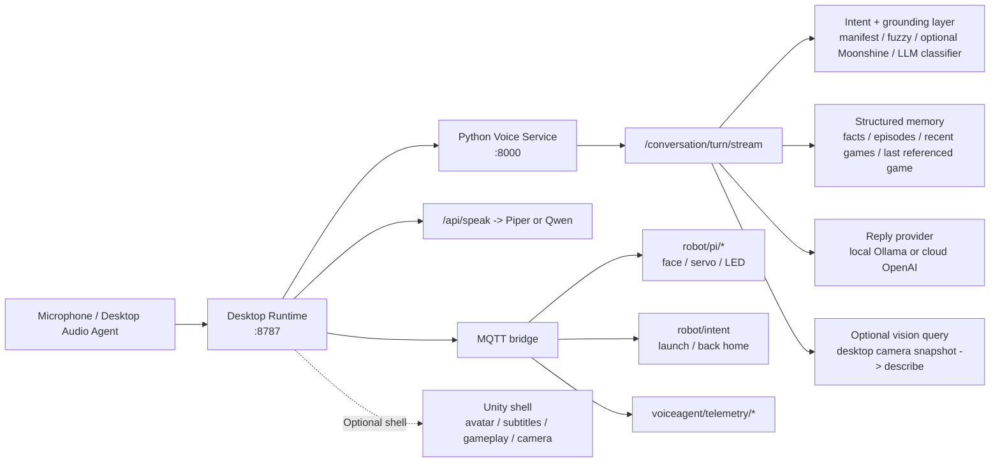
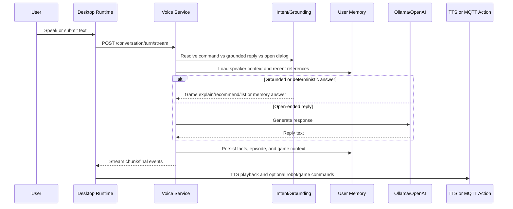
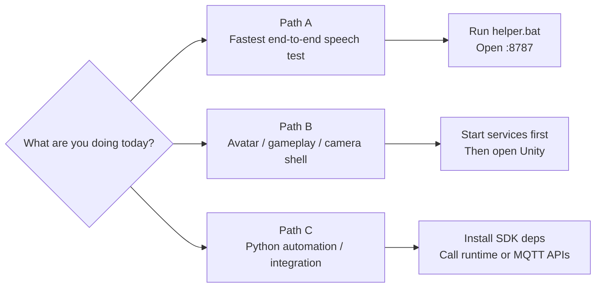

# Voice Agent (Desktop Runtime + Python Services + Optional Unity Shell)

Voice Agent is a local-first voice interaction stack for rehabilitation and exercise-game scenarios.
The maintained fast path is now a standalone desktop runtime on `127.0.0.1:8787` plus Python services for ASR, grounded dialog, memory, TTS, and game launching. Unity is optional and currently treated as a shell layer for avatar/UI/game integration instead of the primary conversation orchestrator.

The repository also includes:
- A Python speech service (`python_voice_service/`) for ASR + LLM reply generation.
- A Python SDK (`python_sdk/`) for non-Unity control and automation.
- Local orchestration scripts for multi-process development.

## At a Glance

| If you want to... | Start here | What you get |
|---|---|---|
| Run the full voice loop with the least setup | `.\helper.bat` -> `http://127.0.0.1:8787` | The maintained path: browser panel, runtime switching, memory tools, game manifest tools, camera, and logs |
| Control the agent from Python without opening Unity | [`python_sdk/README.md`](python_sdk/README.md) | SDK access to speech, face, LED, servo, game intents, and prompt control |
| Keep Unity in the loop for avatar/gameplay/camera UI | Start services first, then open the Unity project | Unity acts as an optional shell around the desktop runtime and MQTT actions |
| Package the stack for Windows deployment | [`scripts/packaging/`](scripts/packaging/) and [`docs/DEPLOYMENT_WINDOWS.md`](docs/DEPLOYMENT_WINDOWS.md) | Service executables, installer assets, and a near one-click runtime |

### Default runtime ports

| Component | Port | Notes |
|---|---:|---|
| Desktop runtime / browser panel | `8787` | Main operator surface for runtime config, memory, games, SDK visualizer, and camera tools |
| Python voice service | `8000` | Conversation, ASR, and response APIs |
| Piper HTTP wrapper | `5005` | Main low-latency local TTS path |
| Qwen TTS wrapper | `5006` | Optional alternate TTS backend |
| Telemetry service | `8101` | Exercise/usage metrics aggregation |
| MQTT broker | `1883` | Robot, dialog, intent, and telemetry messaging |

## Recent Updates

- Standalone desktop runtime + panel can now run the full local/cloud conversation loop without Unity Play Mode.
- Direct unified conversation flow is available on `/conversation/turn/stream` with runtime profile switching between `local` and `cloud`.
- Main local speech path is tuned around `moonshine-medium`; cloud STT/response settings are exposed through panel/runtime config.
- Structured memory now stores facts, episodic turns, recent launched games, and last referenced game for contextual follow-ups.
- Grounded game replies now cover explain/recommend/list behavior from the local manifest instead of freeform LLM guesses.
- Contextual command carryover works for phrases such as `Open it.` after a recommendation or grounded explanation.
- Piper runs as a persistent worker instead of a per-request process, which reduces TTS startup cost.
- Repeatable conversation regression now includes profile compare, grounded game cases, and a dedicated memory regression scenario set.

## SDK Spotlight (Start Here for Integration)

If your goal is to control the robot/agent from Python (without editing Unity scenes first), use:

- **SDK guide:** [`python_sdk/README.md`](python_sdk/README.md)

This SDK mirrors the desktop runtime API surface (and remains compatible with the legacy Unity control flows) for TTS, face/LED/servo commands, game intents, and runtime LLM prompt control.
It also includes a browser-based SDK Visualizer at `http://<host>:8787/sdk` for interactive API testing and flow prototyping.

## Table of Contents

- [At a Glance](#at-a-glance)
- [Architecture Overview](#architecture-overview)
- [Repository Layout](#repository-layout)
- [Features](#features)
- [Quick Start Paths](#quick-start-paths)
- [Environment Requirements](#environment-requirements)
- [Detailed Setup](#detailed-setup)
- [Windows Packaging](#windows-packaging)
- [Service Endpoints and MQTT Topics](#service-endpoints-and-mqtt-topics)
- [Python SDK](#python-sdk)
- [SDK Visualizer](#sdk-visualizer)
- [Python Voice Service (ASR + LLM)](#python-voice-service-asr--llm)
- [Intent Service (Routing + Manifest)](#intent-service-routing--manifest)
- [Dialog Service (Speaker Identity + Persistent Memory)](#dialog-service-speaker-identity--persistent-memory)
- [Runtime Config: Save vs Apply](#runtime-config-save-vs-apply)
- [TTS Backends (Piper and Qwen)](#tts-backends-piper-and-qwen)
- [Troubleshooting](#troubleshooting)
- [Development and Tests](#development-and-tests)
- [License](#license)

## Architecture Overview



The maintained speech entry points are `python_voice_service/main.py` for conversation/ASR/TTS control and `python_voice_service/desktop_runtime.py` for the browser panel, runtime switching, and local desktop integration.

### Conversation Turn Lifecycle



## Repository Layout

| Path | Purpose |
|---|---|
| `Assets/` | Unity scenes, scripts, prefabs, browser panel assets, and optional shell integration |
| `python_voice_service/` | FastAPI services for conversation, ASR, desktop runtime, Piper/Qwen wrappers, grounding, and streaming audio tools |
| `python_sdk/` | Python client SDK for robot controls and runtime APIs |
| `scripts/` | Local launcher plus helper services (`intent_service`, `dialog_service`, `telemetry_service`, `game_launcher`, packaging) |
| `runtime/` | Runtime outputs and assets such as eval results, captions, local models, and packaged-service payloads |
| `docs/` | Deployment, integration, live captions, and benchmark planning notes |
| `installer/` | Windows installer scripts and launcher entrypoints |
| `Firmware/` | Hardware-side firmware assets for robot/peripheral integration |
| `tests/` | Smoke tests, route checks, and regression helpers |
| `native/` | Native audio processing helpers |

## Features

- Standalone desktop voice workflow that no longer requires Unity Play Mode for end-to-end speech testing.
- Direct unified conversation stream with runtime switch between `local` and `cloud`.
- ASR mode switch at runtime: `whisper-large-v3`, `moonshine-small`, `moonshine-medium`, `api`.
- Independent speaker ID for `api` and `live-captions`, with closed-set user matching, enrollment clips, and conservative reject-to-anonymous behavior.
- MQTT command publish for face/servo/LED and game intents.
- Intent router with layered strategy: exact alias, fuzzy/phonetic similarity, optional LLM classifier, optional Moonshine embedding matcher.
- Structured memory with speaker identity mapping, facts, episodic recall, recent game history, and contextual game references (`scripts/dialog_service/user_memory.json`).
- Grounded game catalog for explain/recommend/list replies, using local manifest data instead of freeform game descriptions.
- Contextual launch carryover for commands like `Open it.` after a grounded recommendation.
- Optional vision-assisted replies through the desktop runtime camera describe endpoint.
- Telemetry aggregation service for elder-exercise metrics (supports mock seeding).
- Browser control panel over HTTP (default port `8787`) with runtime switching, memory/QMD tools, games, camera, and logs.
- Pluggable TTS backend on stable endpoint (`/speak`) with persistent Piper worker or Qwen wrapper.
- Python SDK parity with Unity panel actions.
- SDK Visualizer (`/sdk`) with step-by-step flow building, execution, and JSON import/export.
- Local multi-process launcher (`scripts/start_local_services.py`).
- Launcher can run source services during development or packaged executables when deployed.
- Repeatable conversation and memory regression entrypoints (`scripts/conversation_eval.py`, `scripts/memory_eval_scenarios.sample.json`).
- External dialogue benchmark shortlist and rollout plan (`docs/DIALOGUE_BENCHMARK_DATASETS.md`).

## Quick Start Paths



### Path A (Recommended): Standalone Desktop Runtime

1. Configure `scripts/local_services.user.json` if you need custom paths or models.
2. Run `.\helper.bat` from the repo root.
3. Open `http://127.0.0.1:8787`.
4. Use `/runtime` to switch `local` / `cloud`, ASR mode, and model/runtime settings.
5. Use `/memory`, `/games`, and `/sdk` for memory inspection, manifest editing, and API testing.

`helper.bat` delegates to `scripts/start_local_services.py`, which can launch source services in development or bundled executables when running from a packaged deployment.

### Path B: Optional Unity Shell

1. Start the standalone services first with `.\helper.bat`.
2. Open the Unity project if you need avatar/gameplay/camera integration.
3. Treat Unity as a shell around the desktop/runtime services rather than the main speech orchestrator.
4. Unity voice fallback is intentionally downgraded and disabled by default.

### Path C: Python SDK Only (Automation / Integration)

1. Install SDK dependencies from `python_sdk/requirements.txt`.
2. Import `voice_agent_sdk` from `python_sdk/`.
3. Connect to broker and call SDK methods (TTS, face, LED, servo, intents).
4. See [`python_sdk/README.md`](python_sdk/README.md).

## Environment Requirements

- **Unity:** `2022.3.56f1c1` (see `ProjectSettings/ProjectVersion.txt`)
- **OS:** Any OS supported by your Unity/Python deployment (Windows is common for this setup)
- **Python:** 3.10+ (3.12 recommended for service environments)
- **MQTT broker:** typically on `1883`
- **Audio:** microphone permission enabled

Optional dependencies:
- Faster-Whisper model files (for Python ASR route)
- Ollama runtime (for `/respond` endpoint)
- Piper executable + ONNX model (for Piper TTS wrapper)
- Qwen TTS environment (separate venv recommended)

## Detailed Setup

### 1) Clone and Open

```bash
git clone <your-voice-agent-repo-url>
cd Voice_Agent
```

Open `Voice_Agent` via Unity Hub.

### 2) Unity Configuration Notes

- Confirm scene references for:
  - `VoskSpeechToText`
  - `VoiceGameLauncher`
  - `VoiceGameWiring`
  - `PiMessageHub` (if used in your scene)
  - `UserTestControlPanel` (optional but strongly recommended for remote testing)
- Enable scripting define `ROBOTVOICE_USE_MQTT` if your build relies on MQTT intent publishing.
- If using wake prompt audio, assign clip references in launcher components.

### 3) Start Local Services

The main local launcher script is:
- `scripts/start_local_services.py`

Important:
- By default, the launcher auto-starts a local MQTT broker (Mosquitto) if available.
- `--hub-cmd` is optional and only needed when you want to override broker startup.
- Use `--no-hub` if you already have an external broker running.
- By default, the script starts voice service + Piper HTTP + Qwen HTTP + intent service + dialog service + telemetry service + game launcher.
- Launcher config file (no env var required): `scripts/local_services.user.json`
  - Sample template: `scripts/local_services.user.sample.json`
  - Editable from User Panel: `/runtime.html` (`/api/runtime/config`)
  - Runtime panel stores path-like fields as absolute paths.
  - Runtime panel supports configurable intent action phrases:
    - launch triggers (for `LAUNCH_GAME`)
    - exit keywords (for `BACK_HOME`)
- Intent alias matching uses `scripts/intent_service/manifest.json` by default (override with `INTENT_MANIFEST_PATH`).
- Game launching reads the same manifest file (override with `GAME_LAUNCHER_MANIFEST_PATH`).
- Each game entry can include `exec`, `workdir`, `args`, and `env`; `LAUNCH_GAME` only opens a process when `exec` is configured.
- If one managed process exits, the launcher shuts down the remaining processes.

Example (PowerShell):

```powershell
# Default standalone startup (no Robot_opr required)
python scripts/start_local_services.py

# Optional: override broker command
python scripts/start_local_services.py --hub-cmd "mosquitto -p 1883 -v"

# Optional: do not start broker (use external one)
python scripts/start_local_services.py --no-hub

# Optional: do not start telemetry service
python scripts/start_local_services.py --no-telemetry
```

You can also pass `--env-file` to preload environment variables.

### 3.5) Optional speaker ID model for API / Live Captions

The desktop audio agent can now run a lightweight independent speaker matcher for the `api` and `live-captions` paths.

- Python dependency: install `python_voice_service/requirements.txt` into `python_voice_service/.venv_asr` so `onnxruntime` is available.
- Default model path: `runtime/models/speaker_id/voxceleb_ECAPA512_LM.onnx`
- Default profile store: `scripts/dialog_service/speaker_profiles.json` (or the same directory as `DIALOG_USER_MEMORY_PATH`)
- Runtime panel support: `/memory.html` for enrollment and `/api/speaker-profiles` for status / record / commit / clear

Recommended env vars when you want to control it explicitly:

- `VOICE_SPEAKER_ID_ENABLED=1`
- `VOICE_SPEAKER_ID_MODEL_PATH=<absolute path to ECAPA ONNX>`
- `VOICE_SPEAKER_ID_PROFILES_PATH=<absolute path to speaker_profiles.json>`

### 4) Optional helper.bat

`helper.bat` now starts `scripts/start_local_services.py` from the repository root using local Python (`py -3` or `python`) and no longer depends on `Robot_opr` paths.

Quick run:

```powershell
.\helper.bat
```

## Windows Packaging

If you want a near one-click deployment for non-programmers:

1. Build Python services into `dist/services/*.exe`:

```powershell
powershell -ExecutionPolicy Bypass -File scripts\packaging\build_services_exe.ps1
```

Optional (include Qwen TTS executable):

```powershell
powershell -ExecutionPolicy Bypass -File scripts\packaging\build_services_exe.ps1 -IncludeQwen
```

The default packaged service set now includes:
- `voice_service.exe`
- `piper_http.exe`
- `desktop_runtime.exe`
- `intent_service.exe`
- `dialog_service.exe`
- `telemetry_service.exe`
- `game_launcher.exe`
- `service_launcher.exe`

2. Put your Unity Windows build output into `dist/unity`.
3. Build the installer (Inno Setup 6 required):

```powershell
powershell -ExecutionPolicy Bypass -File scripts\packaging\build_installer.ps1
```

Optional (bundle Piper runtime + voice model into installer):

```powershell
powershell -ExecutionPolicy Bypass -File scripts\packaging\build_installer.ps1 `
  -PiperRuntimeDir "D:\runtime\piper"
```

`PiperRuntimeDir` should contain at least:
- `piper.exe`
- `models\*.onnx` (for example `models\en_US-lessac-medium.onnx`)
- matching model config file (`.onnx.json` or `.json`)

4. Install and run `start_voice_agent.bat`, then open:
- `http://127.0.0.1:8787/setup.html` (first-run wizard)
- `http://127.0.0.1:8787/games.html` (game executable path + keywords)

One-command release build (services + installer, optionally bundling Piper runtime):

```powershell
powershell -ExecutionPolicy Bypass -File scripts\packaging\build_release_oneclick.ps1 `
  -UnityBuildDir "D:\builds\voice_agent_unity" `
  -PiperRuntimeDir "D:\runtime\piper"
```

Installed one-click launcher behavior:
- double-click desktop icon -> starts packaged services + packaged desktop runtime + optional Unity shell + health-check wait + auto-open panel page.

See full deployment notes in [`docs/DEPLOYMENT_WINDOWS.md`](docs/DEPLOYMENT_WINDOWS.md).

## Service Endpoints and MQTT Topics

### HTTP endpoints

| Service | Default Port | Key Endpoints |
|---|---:|---|
| Desktop Runtime / Panel | `8787` | `/`, `/games`, `/runtime`, `/memory`, `/setup`, `/sdk`, `/api/speak`, `/api/llm/prompt`, `/api/vision/describe`, `/api/face`, `/api/flower`, `/api/led`, `/api/game`, `/api/game/manifest`, `/api/memory`, `/api/speaker-profiles`, `/api/qmd`, `/api/runtime/config`, `/api/runtime/prereq`, `/api/runtime/ollama`, `/api/asr`, `/api/logs/stream` |
| Python Voice Service | `8000` | `/healthz`, `/conversation/config`, `/conversation/turn/stream`, `/transcribe`, `/transcribe/config`, `/respond`, `/respond/config`, `/respond/metrics` |
| Piper wrapper | `5005` | `/speak` (GET/POST), `/speak_stream` |
| Qwen wrapper | `5006` | `/speak` (GET/POST), `/metrics` |
| Telemetry service | `8101` | `/healthz`, `/users`, `/dashboard`, `/metrics/user/{user_id}/weekly`, `/admin/seed-fake`, `/ingest` |

### MQTT topics (core)

| Topic | Direction | Purpose |
|---|---|---|
| `robot/intent` | publish | Launch/exit game intents |
| `robot/pi/face/cmd` | publish | Face expression commands |
| `robot/pi/servo/cmd` | publish | Servo/flower commands |
| `robot/pi/led/cmd` | publish | LED commands |
| `robot/dialog/query` | publish/subscribe | Dialog query path |
| `robot/dialog/answer` | publish/subscribe | Dialog answer path |
| `robot/tts/options` | publish/subscribe | TTS voice/model/speaker options |
| `robot/voice/text` | subscribe (intent service) | Raw recognized text input |
| `voiceagent/telemetry/#` | publish (games), subscribe (telemetry service) | Exercise telemetry events |

For payload examples, see [`docs/INTEGRATION.md`](docs/INTEGRATION.md).

Telemetry quick check (mock data enabled by default):

```powershell
Invoke-RestMethod http://127.0.0.1:8101/metrics/user/demo_user/weekly?days=14
```

## Python SDK

Primary link:
- [`python_sdk/README.md`](python_sdk/README.md)

### What the SDK controls

- Audible speech through Unity panel API (`/api/speak`)
- WAV synthesis through TTS wrapper (`/speak`)
- Face presets/custom commands
- Servo/flower actions
- LED modes
- Game launch/exit intents
- Runtime LLM prompt get/set/reset via Unity panel API (`/api/llm/prompt`)
- Camera vision describe via Unity panel API (`/api/vision/describe`)

### Install

```bash
pip install -r python_sdk/requirements.txt
```

### Import notes

The SDK package lives under `python_sdk/voice_agent_sdk`.  
Run scripts from repo root with `python_sdk` on `PYTHONPATH`, or run from inside `python_sdk`.

Example (PowerShell):

```powershell
$env:PYTHONPATH = "python_sdk"
python .\your_script.py
```

### Minimal usage

```python
from voice_agent_sdk import VoiceAgentClient

client = VoiceAgentClient(host="10.0.0.1")

# Audible TTS via Unity panel API
client.speak("Hello Rachel", voice="en_US", speed=1.0, volume=1.0)

# MQTT controls
client.face_happy(duration=3)
client.led_breathe(color="#00BFFF", brightness=0.8, period=2.5)
client.servo_open_hold()

# Intents
client.launch_game("cornhole")
client.exit_game()

# Runtime LLM prompt through /api/llm/prompt
cfg = client.get_llm_prompt()
client.set_llm_prompt("You are a concise rehab coach. Keep replies short.")
# client.reset_llm_prompt()

# Camera vision describe through /api/vision/describe
vision = client.describe_current_camera("Describe what you see in the current camera frame.")
```

### Key method groups

- Speech:
  - `speak(...)` -> Unity panel `/api/speak` (audible)
  - `synthesize_wav(...)` -> TTS wrapper `/speak` (WAV bytes)
- LLM prompt:
  - `get_llm_prompt()`
  - `set_llm_prompt(prompt)`
  - `reset_llm_prompt()`
- Vision:
  - `describe_current_camera(prompt, model=None)`
- Face:
  - `face_happy()`, `face_neutral()`, `face_sad()`, `face_very_sad()`, `face_excited()`, `face_idle()`, `face_custom(...)`
- Servo:
  - `servo_open()`, `servo_close()`, `servo_open_hold()`, `servo_close_hold()`, `servo_center_hold()`, `servo_stop()`, `servo_open_slow()`, `servo_close_slow()`
- LED:
  - `led_breathe()`, `led_solid()`, `led_random()`, `led_off()`
- Intents/options:
  - `launch_game(...)`, `exit_game()`, `set_tts_options(...)`, `set_dialog_style(...)`

## SDK Visualizer

The SDK Visualizer is served by the desktop runtime on port `8787` and is designed for rapid integration testing.

Access:
- Start the desktop runtime with `.\helper.bat`.
- Open `http://<host-ip>:8787/sdk` (or `/sdk.html`) in a browser.

Core capabilities:
- SDK method sandbox:
  - Select a mapped SDK method (for example `speak`, `set_llm_prompt`, `launch_game`).
  - Auto-fill endpoint and payload templates.
  - Send request and inspect HTTP status + response body directly in the UI.
- Flow Builder:
  - Drag method templates into a canvas and run steps sequentially.
  - Add utility nodes: `delay(ms)`, `condition(expr)`, and `wait_keyword(keyword)`.
  - Reorder, delete, and edit steps with per-step configuration.
  - Configure API step behavior such as HTTP method, JSON payload, and `continueOnError`.
- Condition and context controls:
  - Condition expressions can use flow context values such as `ctx.lastStatus`, `ctx.lastJson`, `ctx.lastRaw`, and `ctx.lastRecognized`.
  - Keyword wait nodes support source filtering (`user` / `coach` / `any`), timeout, poll interval, case sensitivity, and "only new text" matching.
- Debug and sharing:
  - Live run log and per-step state (`running`, `ok`, `error`).
  - Export flow definitions to JSON and import them later for repeatable test scenarios.

This page calls the same `/api/*` routes used by `python_sdk/voice_agent_sdk/client.py`, so it is useful for validating payload shape and backend behavior before writing automation scripts.

### Built-in method templates

Current built-ins in the visualizer method list:

- `speak(text,voice,model,speed,volume)` -> `/api/speak`
- `qwen_speak(text,speaker,instruct)` -> `/api/qwen/speak`
- `set_tts_options(voice,model)` -> `/api/voice`
- `set_tts_model(model)` -> `/api/voice`
- `get_llm_prompt()` -> `/api/llm/prompt` (GET)
- `set_llm_prompt(prompt)` -> `/api/llm/prompt`
- `reset_llm_prompt()` -> `/api/llm/prompt`
- `describe_camera(prompt,model)` -> `/api/vision/describe`
- `launch_game(name)` -> `/api/game`
- `exit_game()` -> `/api/game`
- `face_preset(mode,seconds)` -> `/api/face`
- `flower_open()` -> `/api/flower`
- `led_breathe(color,brightness,period,duration)` -> `/api/led`

### Flow node types and fields

- `api` node:
  - Fields: `endpoint`, `method`, `payload`, `continueOnError`.
  - Behavior: sends HTTP request; flow stops on failure unless `continueOnError=true`.
- `delay` node:
  - Field: `delayMs`.
  - Behavior: sleeps for the specified milliseconds.
- `condition` node:
  - Field: `expression` (JavaScript expression).
  - Context: can reference `ctx.lastStatus`, `ctx.lastJson`, `ctx.lastRaw`, `ctx.lastRecognized`.
  - Behavior: node passes only when expression evaluates truthy; otherwise flow fails.
- `keyword_wait` node:
  - Fields: `keyword`, `timeoutMs`, `pollMs`, `source`, `caseSensitive`, `onlyNew`.
  - Behavior: polls conversation logs until keyword appears or timeout expires.
  - `source` options: `user`, `coach`, `any`.

### Execution model

- Flow runs strictly in order from step 1 to N.
- Per-step visual state:
  - `running` while executing
  - `ok` on success
  - `error` on failure
- Stop behavior:
  - `Stop` requests cancellation of the active run token.
  - Next loop boundary or poll cycle exits with `Stopped`.
- Import/export behavior:
  - Export writes an array of step objects (no binary data).
  - Import validates known `type` values and skips unsupported entries.

### Flow JSON example

```json
[
  {
    "type": "api",
    "name": "Set concise prompt",
    "endpoint": "/api/llm/prompt",
    "method": "POST",
    "payload": {
      "prompt": "You are a concise rehab coach. Keep replies under 2 sentences."
    },
    "continueOnError": false
  },
  {
    "type": "api",
    "name": "Speak intro",
    "endpoint": "/api/speak",
    "method": "POST",
    "payload": {
      "text": "Hello, let's begin today's session.",
      "voice": "en_US",
      "speed": 1.0,
      "volume": 1.0
    },
    "continueOnError": false
  },
  {
    "type": "keyword_wait",
    "name": "Wait for thanks",
    "keyword": "thanks",
    "timeoutMs": 12000,
    "pollMs": 350,
    "source": "user",
    "caseSensitive": false,
    "onlyNew": true
  },
  {
    "type": "api",
    "name": "Happy face",
    "endpoint": "/api/face",
    "method": "POST",
    "payload": {
      "mode": "happy",
      "seconds": 3
    },
    "continueOnError": false
  }
]
```

## Python Voice Service (ASR + LLM)

Service file: `python_voice_service/main.py`

### Main endpoints

- `POST /conversation/turn/stream` -> unified streaming conversation turn (route, chunk, final)
- `GET /conversation/config` -> read active conversation profile/runtime
- `POST /conversation/config` -> switch local/cloud profile, ASR mode, and response provider settings
- `POST /transcribe` -> ASR output (speech JSON + metadata)
- `GET /transcribe/config` -> read current ASR mode (`whisper-large-v3`, `moonshine-small`, `moonshine-medium`, or `api`)
- `POST /transcribe/config` -> switch ASR mode at runtime
- `POST /respond` -> LLM reply generation
- `GET /respond/config` -> current runtime/system prompt
- `POST /respond/config` -> set/reset runtime prompt
- `GET /respond/metrics` -> reply latency metrics
- `GET /healthz` -> health check

### Quick run

```bash
cd python_voice_service
python -m venv .venv
# Windows: .venv\Scripts\activate
# macOS/Linux: source .venv/bin/activate
pip install -r requirements.txt
uvicorn main:app --host 0.0.0.0 --port 8000
```

### Useful environment variables

- Whisper model/runtime:
  - `WHISPER_MODEL_PATH`
  - `WHISPER_DEVICE`
  - `WHISPER_COMPUTE_TYPE`
- ASR mode / OpenAI:
  - `TRANSCRIBE_MODE` (`whisper-large-v3` | `moonshine-small` | `moonshine-medium` | `api`)
  - `OPENAI_API_KEY`
  - `OPENAI_TRANSCRIBE_MODEL`
  - `OPENAI_TRANSCRIBE_PROMPT` (optional; recommended to keep empty)
  - `ASR_API_LANGUAGE` (default `en`)
  - `ASR_API_FORCE_LANGUAGE` (default `0`; set to `1` only if you want API mode to force `ASR_API_LANGUAGE`)
- Wake word normalization:
  - `WAKE_WORD`
  - `WAKE_WORD_ALIASES`
  - `WAKE_WORD_PREFIXES`
- Ollama:
  - `OLLAMA_BASE_URL`
  - `OLLAMA_MODEL`
  - `OLLAMA_THINK` (`0` for no-thinking mode, `1` to enable reasoning where supported)
  - `OLLAMA_TEMPERATURE` (recommended `0.7` for qwen no-thinking dialogue)
  - `OLLAMA_TOP_P` (recommended `0.8`)
  - `OLLAMA_TOP_K` (recommended `20`)
  - `OLLAMA_SYSTEM_PROMPT`

### ASR mode matrix and runtime switch

| Mode | Type | Typical use |
|---|---|---|
| `whisper-large-v3` | local/offline | highest local accuracy baseline in this project |
| `moonshine-medium` | local/offline | faster local inference with good command recognition |
| `moonshine-small` | local/offline | lowest local compute cost |
| `api` | cloud/online | OpenAI STT path (`OPENAI_API_KEY` required) |

Notes:
- Current integrated Moonshine choices in this repo are `small` and `medium`.
- If Moonshine dependency is unavailable at service startup, `available_modes` will not include Moonshine entries.

Voice service runtime switch:

```powershell
# Check active mode and available_modes
curl http://127.0.0.1:8000/transcribe/config

# Switch mode at runtime
curl -X POST http://127.0.0.1:8000/transcribe/config `
  -H "Content-Type: application/json" `
  -d "{\"mode\":\"moonshine-medium\"}"
```

User Panel runtime switch (delegates to voice service):

```powershell
curl -X POST http://127.0.0.1:8787/api/asr `
  -H "Content-Type: application/json" `
  -d "{\"action\":\"set_mode\",\"mode\":\"moonshine-medium\"}"
```

More details are documented in [`python_voice_service/README.md`](python_voice_service/README.md).

## Intent Service (Routing + Manifest)

Core files:
- `scripts/intent_service/intent_service_impl.py`: MQTT message ingress/egress and payload passthrough.
- `scripts/intent_service/intent_routing.py`: route orchestration.
- `scripts/intent_service/manifest_resolver.py`: manifest alias loading + canonical/fuzzy resolution.
- `scripts/intent_service/llm_classifier.py`: optional LLM intent classification with confidence gating.
- `scripts/intent_service/match_utils.py`: normalization, similarity, phonetic matching utilities.

Routing order (high level):
1. Wake-word gate (optional).
2. Optional LLM classifier (`LAUNCH_GAME` / `BACK_HOME` / `QUERY`) with confidence threshold.
3. Exact manifest alias match.
4. BACK_HOME semantic similarity fallback.
5. Optional Moonshine embedding intent matcher.
6. Manifest fuzzy/phonetic fallback.
7. Default to `QUERY` -> `robot/dialog/query`.

### Manifest authoring

Default manifest path:
- `scripts/intent_service/manifest.json`

Each game can define:
- `id`, `name`, `synonyms`
- `exec`, `workdir`, `args`, `env` (launcher-side process launch fields)

Alias guidance:
- Put likely ASR confusions in `synonyms` (for example pronunciation-near variants).
- Keep canonical game names stable; map fuzzy variants to those canonical names.

### Intent toggles and thresholds

From `scripts/local_services.user.json` (`intent` section) or env:
- `use_llm_classifier` / `INTENT_USE_LLM_CLASSIFIER`
- `use_moonshine_intent_recognizer` / `INTENT_USE_MOONSHINE_RECOGNIZER`
- `launch_triggers`, `exit_keywords`
- `INTENT_BACK_HOME_SIMILARITY_THRESHOLD`
- `INTENT_MOONSHINE_THRESHOLD`

## Dialog Service (Speaker Identity + Persistent Memory)

Core files:
- `scripts/dialog_service/dialog_service_impl.py`: subscribes `robot/dialog/query`, calls `/respond`, publishes answers.
- `scripts/dialog_service/user_memory.py`: speaker identity map + memory extraction + persistence.
- `scripts/dialog_service/onnx_embedder.py`: optional ONNX embedding backend (MiniLM/BGE).
- `scripts/dialog_service/dialog_config.py`: all memory/embedder runtime settings.

Speaker identity key priority:
1. `speaker_profile_id`
2. `speaker_index` + `speaker_id` (Moonshine speaker tags)
3. fallback `source:default`

Memory model in the current build:
- Structured facts:
  - `name`
  - `favorite_game`
  - `likes` / `dislikes`
  - `goals`
  - `origin`
  - `preferred_training_day`
  - `preferred_training_time`
- Episodic memory:
  - recent user/assistant turns
  - `What did I say about ...` style recall
- Game context memory:
  - recent launched games
  - last referenced/recommended/explained game
  - enables follow-ups like `Open it.`
- QMD export/import:
  - available through desktop runtime `/api/qmd`
  - intended as an editable interchange layer, not the primary runtime store

Persistence behavior:
- Memory store path defaults to `scripts/dialog_service/user_memory.json`.
- Identity map + profile memory are saved continuously and reused across service restarts.
- The same store now carries structured facts, episodes, game history, and contextual game references.
- The file is intentionally gitignored as local runtime state.

Embedding backends for memory retrieval:
- MiniLM (default): `onnx-models/all-MiniLM-L6-v2-onnx`
- BGE option: `Qdrant/bge-small-en-v1.5-onnx-Q`

Deterministic memory replies currently cover:
- `What is my name?`
- `What do I like?`
- `What don't I like?`
- `What is my favorite game?`
- `What is my goal?`
- `Where am I from?`
- `When do I prefer to train?`
- `What did I say about ... ?`
- `What do you remember about me?`

Useful dialog memory env vars:
- `DIALOG_ENABLE_USER_MEMORY`
- `DIALOG_ENABLE_USER_MEMORY_EMBEDDINGS`
- `DIALOG_USER_MEMORY_EMBEDDER` (`minilm` or `bge`)
- `DIALOG_USER_MEMORY_EMBEDDING_REPO_ID`
- `DIALOG_USER_MEMORY_PATH`
- `DIALOG_USER_MEMORY_RETRIEVE_TOP_K`
- `DIALOG_ENABLE_CONTEXT_MEMORY` (short-term multi-turn context + summary)
- `DIALOG_ENABLE_POLICY` (continue/switch/clarify policy hints to `/respond`)
- `DIALOG_HISTORY_TURNS`
- `DIALOG_SUMMARY_MAX_CHARS`
- `DIALOG_CONTEXT_MAX_CHARS`
- `DIALOG_MEMORY_QUERY_RULE` (rule-based memory query trigger)
- `DIALOG_MEMORY_QUERY_SEMANTIC` (embedding semantic fallback trigger)
- `DIALOG_MEMORY_QUERY_THRESHOLD` (semantic trigger threshold, default `0.42`)

## Runtime Config: Save vs Apply

Not every panel save is instant for all services. Use the table below:

| Operation | Endpoint | Effect timing |
|---|---|---|
| Save launcher/service config | `POST /api/runtime/config` | writes `scripts/local_services.user.json`; restart `scripts/start_local_services.py` to apply to managed services |
| Save game manifest | `POST /api/game/manifest` | writes manifest immediately; restart `intent_service` and `game_launcher` for consistent pickup |
| Switch ASR mode | `POST /api/asr` (`set_mode`) | immediate (calls voice service runtime config API) |
| Set/reset respond system prompt | `POST /respond/config` or panel `/api/llm/prompt` | immediate |

## TTS Backends (Piper and Qwen)

Both wrappers expose compatible `/speak` routes:
- Piper wrapper: `python_voice_service/piper_http.py`
- Qwen wrapper: `python_voice_service/qwen_tts_http.py`

Typical defaults:
- Piper on `5005`
- Qwen on `5006`

Override commands explicitly with launcher arguments:

```powershell
python scripts/start_local_services.py `
  --piper-http-cmd "uvicorn piper_http:app --host 0.0.0.0 --port 5005" `
  --qwen-http-cmd "uvicorn qwen_tts_http:app --host 0.0.0.0 --port 5006"
```

If you use Qwen TTS and Faster-Whisper together, keep separate virtual environments to avoid dependency conflicts.

## Troubleshooting

- No speech recognized:
  - Check microphone permission.
  - Verify the desktop runtime and voice service are both healthy on `8787` and `8000`.
  - If you are using Unity shell mode, confirm Unity component references are not null.
- ASR dropdown shows fewer modes than expected:
  - Check `GET /api/asr` or `GET /transcribe/config` and inspect `available_modes`.
  - Ensure `moonshine-voice` is installed in the same venv used by `python_voice_service`.
  - Restart voice service after dependency changes.
- OpenAI API ASR returns non-English text or unstable game words:
  - Keep `OPENAI_TRANSCRIBE_PROMPT` empty unless you have a strict reason to set it.
  - Prompt text is a soft bias, not a hard constraint; over-specific prompts can cause leakage/hallucination.
  - Confirm API mode is active (`/transcribe/config`).
  - If you need forced English in API mode, explicitly set `ASR_API_FORCE_LANGUAGE=1` and `ASR_API_LANGUAGE=en`.
  - Restart `service_launcher` and `voice_service` after changing runtime config, because env-backed options are loaded at process start.
- Helper/start script raises WinError 2 (file not found):
  - Validate Python executable paths in `scripts/local_services.user.json` (`python.asr`, `python.tts`).
  - If paths include spaces, keep them as plain JSON strings; the launcher handles process argument splitting.
  - Prefer launching from repo root with `python scripts/start_local_services.py` to verify baseline behavior.
- MQTT commands not received:
  - Verify broker host/port and credentials.
  - Confirm topic names match your robot-side subscribers.
- `/api/speak` fails:
  - Ensure the desktop runtime is listening on `8787`.
- `/transcribe` fails:
  - Check `WHISPER_MODEL_PATH` and model availability.
  - Check Python service logs for load/runtime errors.
- `/respond` is slow or failing:
  - Confirm Ollama is reachable and model exists.
  - Use `/respond/metrics` for latency visibility.
- Intent recognition misses near-pronunciation phrases:
  - Add those variants to `scripts/intent_service/manifest.json` `synonyms`.
  - Tune `use_moonshine_intent_recognizer` and threshold settings.
  - Keep `launch_triggers` and `exit_keywords` focused and short to reduce false positives.
- No LLM spoken reply from dialog path:
  - Check `dialog_service` subscription topics: `robot/dialog/query` and `robot/tts/options`.
  - Check `/respond` availability on port `8000`.
  - Verify the desktop TTS path is active and not blocked by backend errors.

## Development and Tests

SDK tests:

```bash
pip install -r python_sdk/requirements-dev.txt
python -m pytest tests/test_voice_agent_sdk.py
```

Service smoke tests (intent + dialog memory pipeline):

```powershell
# First time only in the service venv
.\python_voice_service\.venv_asr\Scripts\python.exe -m pip install pytest

# Run full smoke suite (services + userpanel route contract + userpanel live checks)
.\python_voice_service\.venv_asr\Scripts\python.exe scripts\run_smoke_tests.py
```

Smoke suite composition:
- `tests/test_smoke_services.py`: intent routing core paths, identity passthrough, dialog memory persistence/retrieval.
- `tests/test_smoke_userpanel_contract.py`: validates every `UserTestControlPanel` route has a smoke case.
- `tests/test_smoke_userpanel_live.py`: executes route smoke calls against live panel endpoint (`8787` by default).

User Panel full API smoke (live integration against running desktop runtime panel):

```powershell
# Optional explicit panel URL
.\python_voice_service\.venv_asr\Scripts\python.exe scripts\run_smoke_tests.py --panel-url http://127.0.0.1:8787

# Optional: skip live panel checks (minimal smoke)
.\python_voice_service\.venv_asr\Scripts\python.exe scripts\run_smoke_tests.py --no-panel-live
```

Direct pytest target:

```powershell
.\python_voice_service\.venv_asr\Scripts\python.exe -m pytest tests\test_smoke_services.py -q
```

Conversation regression:

```powershell
.\python_voice_service\.venv_asr\Scripts\python.exe scripts\conversation_eval.py
```

Text-only public benchmark suite:

```powershell
# First time only
.\python_voice_service\.venv_asr\Scripts\python.exe -m pip install -r scripts\requirements-benchmarks.txt

# Rebuild benchmark scenarios from public dialogue datasets
.\python_voice_service\.venv_asr\Scripts\python.exe scripts\build_dialogue_benchmark_suite.py `
  --output scripts\dialogue_benchmark_scenarios.sample.json

# Run the text-only benchmark suite against the current local agent
.\python_voice_service\.venv_asr\Scripts\python.exe scripts\conversation_eval.py `
  --scenarios scripts\dialogue_benchmark_scenarios.sample.json `
  --output runtime\evals\latest_dialogue_benchmark_eval.json
```

Dedicated memory regression:

```powershell
.\python_voice_service\.venv_asr\Scripts\python.exe scripts\conversation_eval.py `
  --scenarios scripts\memory_eval_scenarios.sample.json `
  --output runtime\evals\latest_memory_eval.json
```

Regression artifacts:
- broad conversation report: `runtime/evals/latest_conversation_eval.json`
- text-only public benchmark report: `runtime/evals/latest_dialogue_benchmark_eval.json`
- memory-focused report: `runtime/evals/latest_memory_eval.json`

Current regression coverage includes:
- command launch / exit
- local/cloud profile compare
- grounded game explain / recommend
- structured memory write + recall
- episodic recall
- recommendation carryover (`Open it.` after recommendation)

Recommended public dialogue benchmark shortlist for future eval expansion:
- [`docs/DIALOGUE_BENCHMARK_DATASETS.md`](docs/DIALOGUE_BENCHMARK_DATASETS.md)

When updating SDK behavior, keep `tests/test_voice_agent_sdk.py` aligned with API expectations.
When updating local services (`intent_service`, `dialog_service`, `python_voice_service`) or panel APIs, run smoke tests before commit. Default policy in this repo is full smoke first, then optional targeted reruns.

## License

MIT License. See [`LICENSE`](LICENSE).
